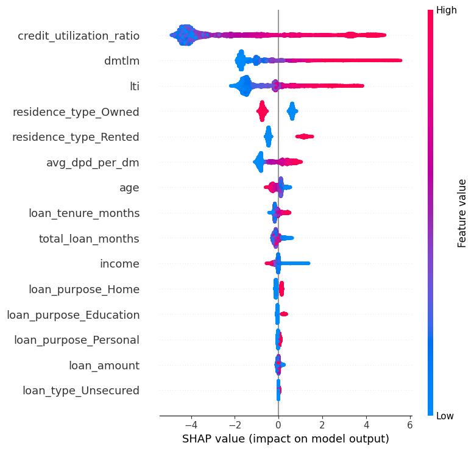
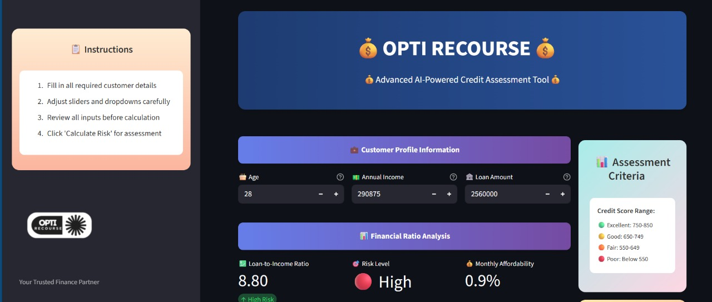

## 🔍 Default Risk Prediction: Model Evaluation and Deployment

### Overview
The project develops a machine learning model to predict default risk with high accuracy and interpretability.  
It leverages advanced techniques to provide actionable insights, making it suitable for **real-world deployment**.

### Key Features
- **Dataset**: Imbalanced classification problem (~10% defaults).
- **Techniques**:
  - Feature engineering using domain relevance and statistical analysis.
  - Resampling methods (SMOTE, under-sampling).
- **Models Evaluated**:
  - Logistic Regression
  - Random Forest
  - XGBoost

### Selected Model
- **Final Model**: XGBoost with Optuna hyperparameter tuning and under-sampling.
- **Metrics**:
  - AUC: 0.98
  - Gini Coefficient: 0.97
  - KS Statistic: 86.87%
- **Interpretability Tools**:
  - **SHAP** (feature importance)  
    

  - **LIME** (local interpretability)  
    

### Key Results
- High precision and recall for classifying defaults.
- Decile analysis confirms strong separation of high-risk instances.

#### Deployment Readiness
- ✅ High performance across metrics  
- ✅ Interpretability aligns with business/regulatory needs  
- ⚡ Retraining recommended to mitigate under-sampling risks  

---

---

## ⚙️ Installation Guide

### Step 1: Clone the Repository
```bash
git clone https://github.com/jainrakshit24/OPTI_Recourse.git
cd OPTI_Recourse
````

### Step 2: Set Up Python Environment

Make sure you have **Python 3.8+** installed.
Use a virtual environment for best practice:

```bash
python -m venv venv
# macOS/Linux
source venv/bin/activate
# Windows
venv\Scripts\activate
```

### Step 3: Install Dependencies

```bash
pip install -r requirements.txt
```

### Step 4: Run the Streamlit App

```bash
streamlit run main.py
```

---

## ▶️ How It Will Run

Once you run the above command:

1. **Streamlit starts a local server**.

   * You will see a link in your terminal (usually `http://localhost:8501/`).

2. **Open the link in a browser**.

   * The homepage of the app will appear with input fields and sliders.

3. **Enter borrower details** such as:

   * Age
   * Income
   * Loan Amount
   * Employment Details, etc.

4. **Click “Calculate Risk”**.

   * The app will process inputs using the trained ML model.
   * Predictions are displayed instantly:

     * 📊 Default Probability
     * 📈 Credit Score
     * 🏦 Credit Rating

5. **Visual Insights**

   * The dashboard also shows SHAP & LIME explanations for interpretability.

6. **Business Use Case**

   * Financial institutions can use the model to quickly screen borrowers before loan approval.

---

## 📦 Dependencies

Main libraries used:

* `streamlit` → interactive dashboard
* `scikit-learn` → preprocessing, metrics
* `xgboost` → final model
* `optuna` → hyperparameter tuning
* `shap`, `lime` → model interpretability
* `pandas`, `numpy` → data processing
* `joblib` → model serialization

(All dependencies listed in `requirements.txt`)

---

## 🖼 Example Screenshots

1. **Dashboard Home** – Input borrower details.
2. **Results Page** – Risk prediction, score & rating.



---

## 🌟 Why This Project Stands Out

* Combines **state-of-the-art ML techniques** with interpretability.
* Addresses a **real-world business problem** with rigor and precision.
* Clear pipeline: **Model development → Evaluation → Deployment**.

---

## 📜 License

This project is licensed under the terms of the **MIT License**.

---

👤 Developed by **[Rakshit Jain](https://github.com/jainrakshit24)**

```
